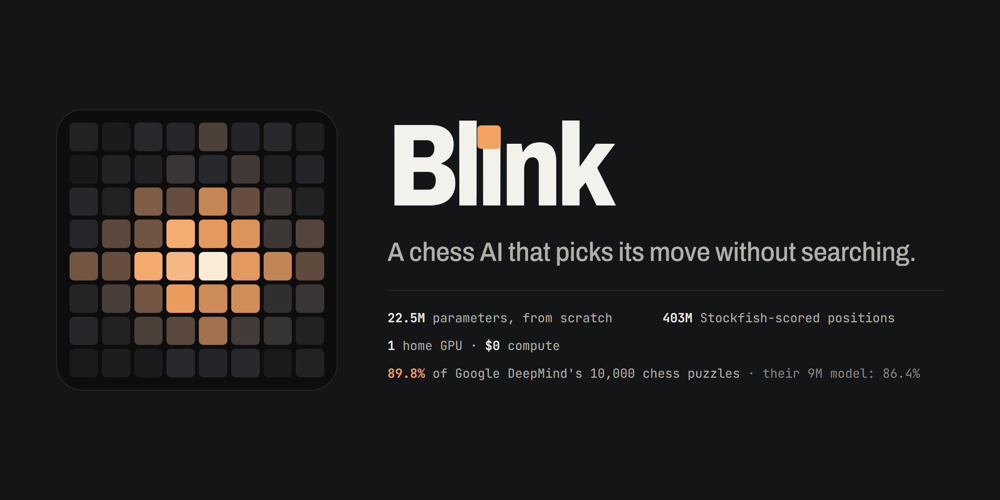

# Blink



A chess AI that picks its move without searching: a 22.5M-parameter transformer trained from random
weights, by supervised learning on 403M positions from the [Lichess evaluation database](https://database.lichess.org/#evals)
(each scored by Stockfish, CC0), on one home RTX 3070, for $0.

The logo above is not a drawing. Each of its 64 cells is a real number from the trained model: how alike
Blink thinks each square is to e4. Nobody told it which squares are neighbours; it learned that from the
positions.

## Results

Google DeepMind's 10,000-puzzle benchmark from
[Grandmaster-Level Chess Without Search](https://arxiv.org/abs/2402.04494) (Ruoss et al., 2024). Both
models were measured here, on the same puzzles, with the same scorer: DeepMind's released 9M checkpoint
was ported to PyTorch and re-measured rather than quoted from the paper.

| all 10,000 puzzles | solved | 95% interval |
|---|---|---|
| **Blink**, one look per move (value mode) | **89.8%** (8,981) | 89.2 to 90.4 |
| Blink, one look (policy mode) | 83.8% (8,375) | 83.0 to 84.5 |
| DeepMind 9M, EMA weights | 86.4% (8,638) | 85.7 to 87.0 |
| DeepMind 9M, released weights | 86.2% (8,620) | 85.5 to 86.9 |

Head to head on the same puzzles, against DeepMind's better weights: Blink alone solves 698 of them and
DeepMind 9M alone solves 355 (a paired z of 10.6).

By puzzle rating, value mode, all 10,000: 99.5% under 1000, 97.9% at 1000-1500, 90.8% at 1500-2000,
67.9% at 2000-2500 and 30.6% above 2500.

## The idea

Chess engines win by calculating millions of moves ahead. Blink does not calculate. It plays in one of
two ways:

- **One look (policy mode):** one pass through the network, straight to a move.
- **One look per move (value mode):** the network scores the position after each legal move once, in one
  batch, and plays the best. It never looks at the opponent's reply. DeepMind's action-value models play
  the same way.

The exact rule, what counts as search and how every published game proves compliance, is in
[EVAL.md](EVAL.md), written before the models were trained.

## How it was trained

| step | what happened |
|---|---|
| data | 409.7M Lichess positions; 403.5M train roots after a 636,245-position leakage blocklist, 0 leaks in the verify pass |
| recipe | 8 experiments on a 5M-parameter model at 1.5 hours each (7 single changes, then the winners combined), judged against a 3-seed noise floor; only a change that beat the baseline by 2 standard deviations was kept. One did: the Muon optimizer |
| size | the 22.5M model was checked on a 6-hour branch before the long run: 58.7% move agreement with Stockfish, against 55.1% for the small models |
| flagship | 19.6 training hours on the RTX 3070, the last 5.3 of them a cooldown; I stopped it from the interim puzzle checks, once it was clearly past DeepMind's 9M model, by a rule written before the run (EVAL.md, PR-6) |

The puzzle score during training, value mode, on the first 2,000 puzzles:

| training hours | 1.9 | 2.9 | 4.8 | 5.9 | 10.7 | 19.6 (final) |
|---|---|---|---|---|---|---|
| solved | 83.6% | 84.3% | 85.9% | 86.2% | 87.1% | 90.2% |

Every defect found on the way is in [PREFLIGHT.md](PREFLIGHT.md), with the number that exposed it.

## Run the tests

```
uv sync
uv run pytest
```

Code: [MIT](LICENSE). python-chess is a GPL-3.0-or-later runtime dependency (not vendored).
Built with an AI coding agent. I chose the design and the gates, and ran and checked every experiment.
